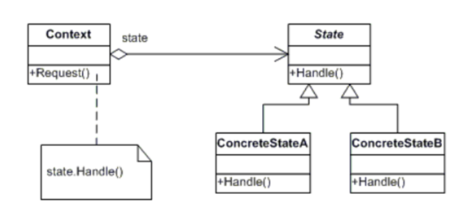

# Hotel SGH
### Sistema de Gestion Hotelera
#### Por: Febre Sebastian

##### LogIn:

##### frmOcupacion / Dashboard:

##### Habitaciones:

##### Agregar Pedido:

##### Reservas:

###### Buscar Cliente:

###### Buscar Habitacion:

##### Clientes:

##### Auditorio:

#### Arquitectura 4 Capas, MVC (Modelo-Vista-Controladora) y Entidades:
1. Capa de Entidades (BE) -> Entidades
1. Capa de Lógica de Negocio (BLL) -> Controladora
1. Capa de Acceso a Datos (DAL) -> Modelo
1. Capa de Presentación (Vista) -> Vista

#### Patron de diseño
##### State:

##### Composite:

#### Diagrama de clases:
